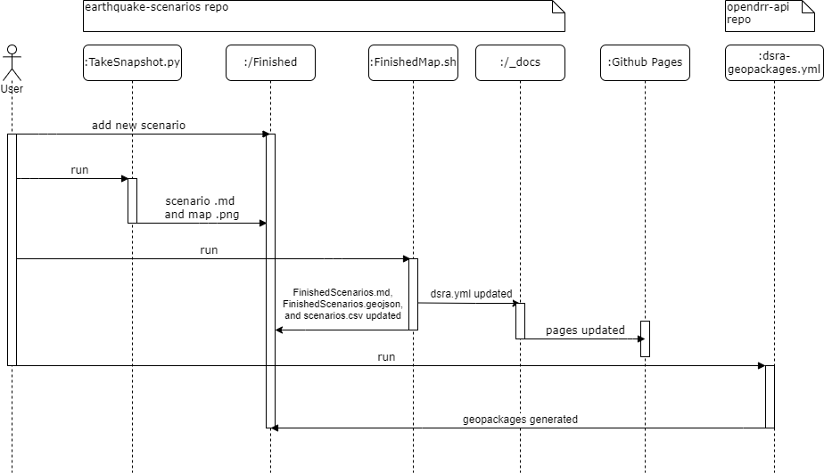

# Workflow

When a new scenario is added to the FINISHED directory, /scripts/TakeSnapshot.py must be run with manual inputs. This will add a small map of the scenario and the scenarios .md file to the FINISHED directory.

Next, scripts/finishedMap.sh must be run. This will update FinishedScenarios.geojson, FinishedScenarios.md, and scenarios.csv in the FINISHED directory, and docs/_data/dsra.yml, which will automatically update github pages.

Finally, geopackages need to be generated and added to FINISHED/geopackages, either manually or through the action in the opendrr-api repo.

# Automated workflow

The files build_check_links.yml and check_links.yml both check for dead links in github pages, with build_check_links.yml pre-building the site when a PR is opened or changed and checking those links, and check_links.yml checking the entirety of https://opendrr.github.io/downloads/ after changes are pushed, to ensure that no links from other sections have been affected.

generate_assets.yml creates release assets whenever a new release is published. Every file in FINISHED/geopackages/ and every .csv in FINISHED are added.
