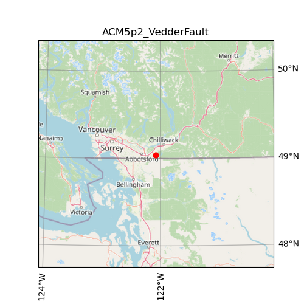

| Name                                | ACM5p2_VedderFault                                                                                                                                                                                                                                                                                                                                                                                                            |
|:------------------------------------|:------------------------------------------------------------------------------------------------------------------------------------------------------------------------------------------------------------------------------------------------------------------------------------------------------------------------------------------------------------------------------------------------------------------------------|
| magnitude                           | 5.2                                                                                                                                                                                                                                                                                                                                                                                                                           |
| latitude                            | 49.040 degrees                                                                                                                                                                                                                                                                                                                                                                                                                |
| longitude                           | -122.080 degrees                                                                                                                                                                                                                                                                                                                                                                                                              |
| maximum_peak_ground_acceleration    | 0.267 g                                                                                                                                                                                                                                                                                                                                                                                                                       |
| recurrence rate                     | 41 years*                                                                                                                                                                                                                                                                                                                                                                                                                     |
|                                     | *For Cascadia, Leech River, and Devil's Mountain Faults these are characteristic earthquakes, else they are recurrence interval for an event of equal or greater magnitude in the scenario source region.                                                                                                                                                                                                                     |
| cost                                | $1,032,104,534                                                                                                                                                                                                                                                                                                                                                                                                                |
| redtag                              | 164 buildings                                                                                                                                                                                                                                                                                                                                                                                                                 |
| displaced                           | 325 people                                                                                                                                                                                                                                                                                                                                                                                                                    |
| deaths                              | 13 people                                                                                                                                                                                                                                                                                                                                                                                                                     |
| critical_injuries_and_entrapments   | 6 people                                                                                                                                                                                                                                                                                                                                                                                                                      |
| all_hospitalizations                | 56 people                                                                                                                                                                                                                                                                                                                                                                                                                     |
| epicentre_map                       |                                                                                                                                                                                                                                                                                                                                                                                           |
| shakemap_file                       | [s_shakemap_ACM5p2_VedderFault_1.csv](https://github.com/OpenDRR/earthquake-scenarios/blob/master/FINISHED/s_shakemap_ACM5p2_VedderFault_1.csv) [<kbd>Download</kbd>](https://github.com/OpenDRR/earthquake-scenarios/raw/master/FINISHED/s_shakemap_ACM5p2_VedderFault_1.csv)                                                                                                                                            |
| damage_baseline_file                | [s_dmgbyasset_ACM5p2_VedderFault_b0_2_b.csv](https://github.com/OpenDRR/earthquake-scenarios/blob/master/FINISHED/s_dmgbyasset_ACM5p2_VedderFault_b0_2_b.csv) [<kbd>Download</kbd>](https://github.com/OpenDRR/earthquake-scenarios/raw/master/FINISHED/s_dmgbyasset_ACM5p2_VedderFault_b0_2_b.csv)                                                                                                                       |
| damage_retrofitted_file             | [s_dmgbyasset_ACM5p2_VedderFault_r1_3_b.csv](https://github.com/OpenDRR/earthquake-scenarios/blob/master/FINISHED/s_dmgbyasset_ACM5p2_VedderFault_r1_3_b.csv) [<kbd>Download</kbd>](https://github.com/OpenDRR/earthquake-scenarios/raw/master/FINISHED/s_dmgbyasset_ACM5p2_VedderFault_r1_3_b.csv)                                                                                                                       |
| consequence_baseline_file           | [s_consequences_ACM5p2_VedderFault_b0_2_b.csv](https://github.com/OpenDRR/earthquake-scenarios/blob/master/FINISHED/s_consequences_ACM5p2_VedderFault_b0_2_b.csv) [<kbd>Download</kbd>](https://github.com/OpenDRR/earthquake-scenarios/raw/master/FINISHED/s_consequences_ACM5p2_VedderFault_b0_2_b.csv)                                                                                                                 |
| consequence_retrofitted_file        | [s_consequences_ACM5p2_VedderFault_r1_3_b.csv](https://github.com/OpenDRR/earthquake-scenarios/blob/master/FINISHED/s_consequences_ACM5p2_VedderFault_r1_3_b.csv) [<kbd>Download</kbd>](https://github.com/OpenDRR/earthquake-scenarios/raw/master/FINISHED/s_consequences_ACM5p2_VedderFault_r1_3_b.csv)                                                                                                                 |
| loss_baseline_file                  | [s_lossesbyasset_ACM5p2_VedderFault_b0_4_b.csv](https://github.com/OpenDRR/earthquake-scenarios/blob/master/FINISHED/s_lossesbyasset_ACM5p2_VedderFault_b0_4_b.csv) [<kbd>Download</kbd>](https://github.com/OpenDRR/earthquake-scenarios/raw/master/FINISHED/s_lossesbyasset_ACM5p2_VedderFault_b0_4_b.csv)                                                                                                              |
| loss_retrofitted_file               | [s_lossesbyasset_ACM5p2_VedderFault_r1_5_b.csv](https://github.com/OpenDRR/earthquake-scenarios/blob/master/FINISHED/s_lossesbyasset_ACM5p2_VedderFault_r1_5_b.csv) [<kbd>Download</kbd>](https://github.com/OpenDRR/earthquake-scenarios/raw/master/FINISHED/s_lossesbyasset_ACM5p2_VedderFault_r1_5_b.csv)                                                                                                              |
| site_model_file                     | [openquake-inputs/earthquake/sites/regions/site-vgrid_BC.csv](https://github.com/OpenDRR/openquake-inputs/blob/main/earthquake/sites/regions/site-vgrid_BC.csv) [<kbd>Download</kbd>](https://github.com/OpenDRR/openquake-inputs/raw/main/earthquake/sites/regions/site-vgrid_BC.csv)                                                                                                                                    |
| rupture_model_file                  | [ruptures/rupture_ACM5p2_VedderFault.xml](https://github.com/OpenDRR/earthquake-scenarios/blob/master/ruptures/rupture_ACM5p2_VedderFault.xml) [<kbd>Download</kbd>](https://github.com/OpenDRR/earthquake-scenarios/raw/master/ruptures/rupture_ACM5p2_VedderFault.xml)                                                                                                                                                  |
| rupture_mesh_spacing                | 4                                                                                                                                                                                                                                                                                                                                                                                                                             |
| gsim_logic_tree_file                | [CanadaSHM6/OpenQuake_model_files/gmms/LogicTree/OQ_classes_NGASa0p3weights_activecrust.xml](https://github.com/OpenDRR/CanadaSHM6/blob/master/OpenQuake_model_files/gmms/LogicTree/OQ_classes_NGASa0p3weights_activecrust.xml) [<kbd>Download</kbd>](https://github.com/OpenDRR/CanadaSHM6/raw/master/OpenQuake_model_files/gmms/LogicTree/OQ_classes_NGASa0p3weights_activecrust.xml)                                   |
| truncation_level_risk               | 3.0                                                                                                                                                                                                                                                                                                                                                                                                                           |
| maximum_distance                    | 400                                                                                                                                                                                                                                                                                                                                                                                                                           |
| number_of_ground_motion_fields_risk | 400                                                                                                                                                                                                                                                                                                                                                                                                                           |
| exposure_file                       | [openquake-inputs/exposure/general-building-stock/oqBldgExp_BC.xml](https://github.com/OpenDRR/openquake-inputs/blob/main/exposure/general-building-stock/oqBldgExp_BC.xml) [<kbd>Download</kbd>](https://github.com/OpenDRR/openquake-inputs/raw/main/exposure/general-building-stock/oqBldgExp_BC.xml)                                                                                                                  |
| taxonomy_mapping_baseline           | [openquake-inputs/earthquake/vulnerability/CanSRM1_TaxMap_b0.csv](https://github.com/OpenDRR/openquake-inputs/blob/main/earthquake/vulnerability/CanSRM1_TaxMap_b0.csv) [<kbd>Download</kbd>](https://github.com/OpenDRR/openquake-inputs/raw/main/earthquake/vulnerability/CanSRM1_TaxMap_b0.csv)                                                                                                                        |
| structural_fragility_file           | [openquake-inputs/earthquake/vulnerability/structural_fragility_CAN.xml](https://github.com/OpenDRR/openquake-inputs/blob/main/earthquake/vulnerability/structural_fragility_CAN.xml) [<kbd>Download</kbd>](https://github.com/OpenDRR/openquake-inputs/raw/main/earthquake/vulnerability/structural_fragility_CAN.xml)                                                                                                   |
| structural_vulnerability_file       | [openquake-inputs/earthquake/vulnerability/vulnerability_structural_CAN.xml](https://github.com/OpenDRR/openquake-inputs/blob/main/earthquake/vulnerability/vulnerability_structural_CAN.xml) [<kbd>Download</kbd>](https://github.com/OpenDRR/openquake-inputs/raw/main/earthquake/vulnerability/vulnerability_structural_CAN.xml)                                                                                       |
| nonstructural_vulnerability_file    | [openquake-inputs/earthquake/vulnerability/vulnerability_nonstructural_CAN.xml](https://github.com/OpenDRR/openquake-inputs/blob/main/earthquake/vulnerability/vulnerability_nonstructural_CAN.xml) [<kbd>Download</kbd>](https://github.com/OpenDRR/openquake-inputs/raw/main/earthquake/vulnerability/vulnerability_nonstructural_CAN.xml)                                                                              |
| contents_vulnerability_file         | [openquake-inputs/earthquake/vulnerability/vulnerability_contents_CAN.xml](https://github.com/OpenDRR/openquake-inputs/blob/main/earthquake/vulnerability/vulnerability_contents_CAN.xml) [<kbd>Download</kbd>](https://github.com/OpenDRR/openquake-inputs/raw/main/earthquake/vulnerability/vulnerability_contents_CAN.xml)                                                                                             |
| description                         | Magnitude 5.2 earthquake scenario along the Vedder fault which strikes 050 degrees and is located approx 18 km E of Abbotsford City Hall according to the British Columbia Geographic Warehouse fault map. Assuming a non vertical fault plane, oblique thrust faulting is inferred based on fault strike plus tectonic stress regime and maximum horizontal stress  orientations in World Stress Map by Heidbach et al 2016. |
