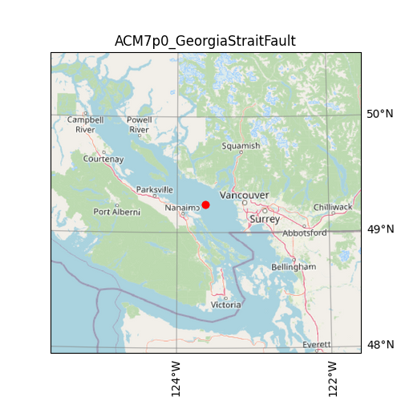

| Name                                | ACM7p0_GeorgiaStraitFault                                                                                                                                                                                                                                                                                                                                                                                    |
|:------------------------------------|:-------------------------------------------------------------------------------------------------------------------------------------------------------------------------------------------------------------------------------------------------------------------------------------------------------------------------------------------------------------------------------------------------------------|
| magnitude                           | 7.0                                                                                                                                                                                                                                                                                                                                                                                                          |
| latitude                            | 49.243 degrees                                                                                                                                                                                                                                                                                                                                                                                               |
| longitude                           | -123.627 degrees                                                                                                                                                                                                                                                                                                                                                                                             |
| maximum_peak_ground_acceleration    | 0.575 g                                                                                                                                                                                                                                                                                                                                                                                                      |
| recurrence rate                     | 1,501 years*                                                                                                                                                                                                                                                                                                                                                                                                 |
|                                     | *For Cascadia, Leech River, and Devil's Mountain Faults these are characteristic earthquakes, else they are recurrence interval for an event of equal or greater magnitude in the scenario source region.                                                                                                                                                                                                    |
| cost                                | $30,308,218,563                                                                                                                                                                                                                                                                                                                                                                                              |
| redtag                              | 10,262 buildings                                                                                                                                                                                                                                                                                                                                                                                             |
| displaced                           | 345,774 people                                                                                                                                                                                                                                                                                                                                                                                               |
| deaths                              | 1,984 people                                                                                                                                                                                                                                                                                                                                                                                                 |
| critical_injuries_and_entrapments   | 990 people                                                                                                                                                                                                                                                                                                                                                                                                   |
| all_hospitalizations                | 7,413 people                                                                                                                                                                                                                                                                                                                                                                                                 |
| epicentre_map                       |                                                                                                                                                                                                                                                                                                                                                                   |
| shakemap_file                       | ./s_shakemap_ACM7p0_GeorgiaStraitFault_124.csv                                                                                                                                                                                                                                                                                                                                                               |
| damage_baseline_file                | ./s_dmgbyasset_ACM7p0_GeorgiaStraitFault_b0_125_b.csv                                                                                                                                                                                                                                                                                                                                                        |
| damage_retrofitted_file             | ./s_dmgbyasset_ACM7p0_GeorgiaStraitFault_r1_126_b.csv                                                                                                                                                                                                                                                                                                                                                        |
| consequence_baseline_file           | ./s_consequences_ACM7p0_GeorgiaStraitFault_b0_125_b.csv                                                                                                                                                                                                                                                                                                                                                      |
| consequence_retrofitted_file        | ./s_consequences_ACM7p0_GeorgiaStraitFault_r1_126_b.csv                                                                                                                                                                                                                                                                                                                                                      |
| loss_baseline_file                  | ./s_lossesbyasset_ACM7p0_GeorgiaStraitFault_b0_127_b.csv                                                                                                                                                                                                                                                                                                                                                     |
| loss_retrofitted_file               | ./s_lossesbyasset_ACM7p0_GeorgiaStraitFault_r1_128_b.csv                                                                                                                                                                                                                                                                                                                                                     |
| site_model_file                     | ../../openquake-inputs/earthquake/sites/regions/site-vgrid_BC.csv                                                                                                                                                                                                                                                                                                                                            |
| rupture_model_file                  | ../ruptures/rupture_ACM7p0_GeorgiaStraitFault.xml                                                                                                                                                                                                                                                                                                                                                            |
| rupture_mesh_spacing                | 4                                                                                                                                                                                                                                                                                                                                                                                                            |
| gsim_logic_tree_file                | ../../CanadaSHM6/OpenQuake_model_files/gmms/LogicTree/OQ_classes_NGASa0p3weights_activecrust.xml                                                                                                                                                                                                                                                                                                             |
| truncation_level_risk               | 3.0                                                                                                                                                                                                                                                                                                                                                                                                          |
| maximum_distance                    | 400                                                                                                                                                                                                                                                                                                                                                                                                          |
| number_of_ground_motion_fields_risk | 400                                                                                                                                                                                                                                                                                                                                                                                                          |
| exposure_file                       | ../../openquake-inputs/exposure/general-building-stock/oqBldgExp_BC.xml                                                                                                                                                                                                                                                                                                                                      |
| taxonomy_mapping_baseline           | ../../openquake-inputs/earthquake/vulnerability/CanSRM1_TaxMap_b0.csv                                                                                                                                                                                                                                                                                                                                        |
| structural_fragility_file           | ../../openquake-inputs/earthquake/vulnerability/structural_fragility_CAN.xml                                                                                                                                                                                                                                                                                                                                 |
| structural_vulnerability_file       | ../../openquake-inputs/earthquake/vulnerability/vulnerability_structural_CAN.xml                                                                                                                                                                                                                                                                                                                             |
| nonstructural_vulnerability_file    | ../../openquake-inputs/earthquake/vulnerability/vulnerability_nonstructural_CAN.xml                                                                                                                                                                                                                                                                                                                          |
| contents_vulnerability_file         | ../../openquake-inputs/earthquake/vulnerability/vulnerability_contents_CAN.xml                                                                                                                                                                                                                                                                                                                               |
| description                         | Georgia Strait Rupture Scenarios using the 1997 Georgia Strait earthquake hypocentre and fault plane geometry from Cassidy, Rogers, & Waldhauser (2000, BSSA). These scenarios use a mapped crustal marine fault near Vancouver, but consider larger magnidue events than those that have been observed to date for that location. Maximum magnitude (7.5) is obtained from CanSHM6 for PUGET SOUND SHALLOW. |