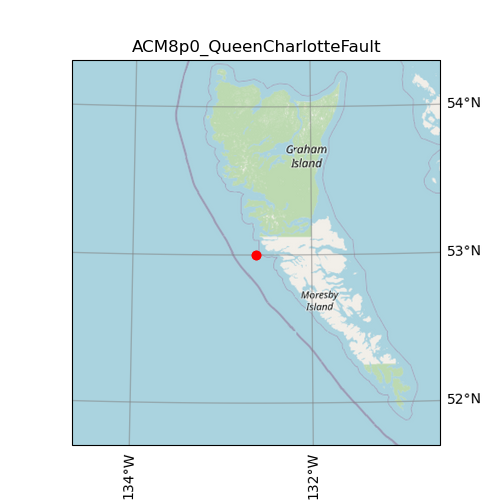

| Name                                | ACM8p0_QueenCharlotteFault                                                                                                                                                                                                                                                                                                                                                                                                                           |
|:------------------------------------|:-----------------------------------------------------------------------------------------------------------------------------------------------------------------------------------------------------------------------------------------------------------------------------------------------------------------------------------------------------------------------------------------------------------------------------------------------------|
| magnitude                           | 8.0                                                                                                                                                                                                                                                                                                                                                                                                                                                  |
| latitude                            | 53.000 degrees                                                                                                                                                                                                                                                                                                                                                                                                                                       |
| longitude                           | -132.620 degrees                                                                                                                                                                                                                                                                                                                                                                                                                                     |
| maximum_peak_ground_acceleration    | 0.412 g                                                                                                                                                                                                                                                                                                                                                                                                                                              |
| recurrence rate                     | -18 years*                                                                                                                                                                                                                                                                                                                                                                                                                                           |
|                                     | *For Cascadia, Leech River, and Devil's Mountain Faults these are characteristic earthquakes, else they are recurrence interval for an event of equal or greater magnitude in the scenario source region.                                                                                                                                                                                                                                            |
| cost                                | $55,490,540                                                                                                                                                                                                                                                                                                                                                                                                                                          |
| redtag                              | 39 buildings                                                                                                                                                                                                                                                                                                                                                                                                                                         |
| displaced                           | 306 people                                                                                                                                                                                                                                                                                                                                                                                                                                           |
| deaths                              | 5 people                                                                                                                                                                                                                                                                                                                                                                                                                                             |
| critical_injuries_and_entrapments   | 2 people                                                                                                                                                                                                                                                                                                                                                                                                                                             |
| all_hospitalizations                | 17 people                                                                                                                                                                                                                                                                                                                                                                                                                                            |
| epicentre_map                       |                                                                                                                                                                                                                                                                                                                                                                                                          |
| shakemap_file                       | [s_shakemap_ACM8p0_QueenCharlotteFault_227.csv](https://github.com/OpenDRR/earthquake-scenarios/blob/master/FINISHED/s_shakemap_ACM8p0_QueenCharlotteFault_227.csv) [<kbd>Download</kbd>](https://github.com/OpenDRR/earthquake-scenarios/raw/master/FINISHED/s_shakemap_ACM8p0_QueenCharlotteFault_227.csv)                                                                                                                                     |
| damage_baseline_file                | [s_dmgbyasset_ACM8p0_QueenCharlotteFault_b0_228_b.csv](https://github.com/OpenDRR/earthquake-scenarios/blob/master/FINISHED/s_dmgbyasset_ACM8p0_QueenCharlotteFault_b0_228_b.csv) [<kbd>Download</kbd>](https://github.com/OpenDRR/earthquake-scenarios/raw/master/FINISHED/s_dmgbyasset_ACM8p0_QueenCharlotteFault_b0_228_b.csv)                                                                                                                |
| damage_retrofitted_file             | [s_dmgbyasset_ACM8p0_QueenCharlotteFault_r1_229_b.csv](https://github.com/OpenDRR/earthquake-scenarios/blob/master/FINISHED/s_dmgbyasset_ACM8p0_QueenCharlotteFault_r1_229_b.csv) [<kbd>Download</kbd>](https://github.com/OpenDRR/earthquake-scenarios/raw/master/FINISHED/s_dmgbyasset_ACM8p0_QueenCharlotteFault_r1_229_b.csv)                                                                                                                |
| consequence_baseline_file           | [s_consequences_ACM8p0_QueenCharlotteFault_b0_228_b.csv](https://github.com/OpenDRR/earthquake-scenarios/blob/master/FINISHED/s_consequences_ACM8p0_QueenCharlotteFault_b0_228_b.csv) [<kbd>Download</kbd>](https://github.com/OpenDRR/earthquake-scenarios/raw/master/FINISHED/s_consequences_ACM8p0_QueenCharlotteFault_b0_228_b.csv)                                                                                                          |
| consequence_retrofitted_file        | [s_consequences_ACM8p0_QueenCharlotteFault_r1_229_b.csv](https://github.com/OpenDRR/earthquake-scenarios/blob/master/FINISHED/s_consequences_ACM8p0_QueenCharlotteFault_r1_229_b.csv) [<kbd>Download</kbd>](https://github.com/OpenDRR/earthquake-scenarios/raw/master/FINISHED/s_consequences_ACM8p0_QueenCharlotteFault_r1_229_b.csv)                                                                                                          |
| loss_baseline_file                  | [s_lossesbyasset_ACM8p0_QueenCharlotteFault_b0_230_b.csv](https://github.com/OpenDRR/earthquake-scenarios/blob/master/FINISHED/s_lossesbyasset_ACM8p0_QueenCharlotteFault_b0_230_b.csv) [<kbd>Download</kbd>](https://github.com/OpenDRR/earthquake-scenarios/raw/master/FINISHED/s_lossesbyasset_ACM8p0_QueenCharlotteFault_b0_230_b.csv)                                                                                                       |
| loss_retrofitted_file               | [s_lossesbyasset_ACM8p0_QueenCharlotteFault_r1_231_b.csv](https://github.com/OpenDRR/earthquake-scenarios/blob/master/FINISHED/s_lossesbyasset_ACM8p0_QueenCharlotteFault_r1_231_b.csv) [<kbd>Download</kbd>](https://github.com/OpenDRR/earthquake-scenarios/raw/master/FINISHED/s_lossesbyasset_ACM8p0_QueenCharlotteFault_r1_231_b.csv)                                                                                                       |
| site_model_file                     | [openquake-inputs/earthquake/sites/regions/site-vgrid_BC.csv](https://github.com/OpenDRR/openquake-inputs/blob/main/earthquake/sites/regions/site-vgrid_BC.csv) [<kbd>Download</kbd>](https://github.com/OpenDRR/openquake-inputs/raw/main/earthquake/sites/regions/site-vgrid_BC.csv)                                                                                                                                                           |
| rupture_model_file                  | [ruptures/rupture_ACM8p0_QueenCharlotteFault.xml](https://github.com/OpenDRR/earthquake-scenarios/blob/master/ruptures/rupture_ACM8p0_QueenCharlotteFault.xml) [<kbd>Download</kbd>](https://github.com/OpenDRR/earthquake-scenarios/raw/master/ruptures/rupture_ACM8p0_QueenCharlotteFault.xml)                                                                                                                                                 |
| rupture_mesh_spacing                | 4                                                                                                                                                                                                                                                                                                                                                                                                                                                    |
| gsim_logic_tree_file                | [CanadaSHM6/OpenQuake_model_files/gmms/LogicTree/OQ_classes_NGASa0p3weights_activecrust.xml](https://github.com/OpenDRR/CanadaSHM6/blob/master/OpenQuake_model_files/gmms/LogicTree/OQ_classes_NGASa0p3weights_activecrust.xml) [<kbd>Download</kbd>](https://github.com/OpenDRR/CanadaSHM6/raw/master/OpenQuake_model_files/gmms/LogicTree/OQ_classes_NGASa0p3weights_activecrust.xml)                                                          |
| truncation_level_risk               | 3.0                                                                                                                                                                                                                                                                                                                                                                                                                                                  |
| maximum_distance                    | 400                                                                                                                                                                                                                                                                                                                                                                                                                                                  |
| number_of_ground_motion_fields_risk | 400                                                                                                                                                                                                                                                                                                                                                                                                                                                  |
| exposure_file                       | [openquake-inputs/exposure/general-building-stock/oqBldgExp_BC.xml](https://github.com/OpenDRR/openquake-inputs/blob/main/exposure/general-building-stock/oqBldgExp_BC.xml) [<kbd>Download</kbd>](https://github.com/OpenDRR/openquake-inputs/raw/main/exposure/general-building-stock/oqBldgExp_BC.xml)                                                                                                                                         |
| taxonomy_mapping_baseline           | [openquake-inputs/earthquake/vulnerability/CanSRM1_TaxMap_b0.csv](https://github.com/OpenDRR/openquake-inputs/blob/main/earthquake/vulnerability/CanSRM1_TaxMap_b0.csv) [<kbd>Download</kbd>](https://github.com/OpenDRR/openquake-inputs/raw/main/earthquake/vulnerability/CanSRM1_TaxMap_b0.csv)                                                                                                                                               |
| structural_fragility_file           | [openquake-inputs/earthquake/vulnerability/structural_fragility_CAN.xml](https://github.com/OpenDRR/openquake-inputs/blob/main/earthquake/vulnerability/structural_fragility_CAN.xml) [<kbd>Download</kbd>](https://github.com/OpenDRR/openquake-inputs/raw/main/earthquake/vulnerability/structural_fragility_CAN.xml)                                                                                                                          |
| structural_vulnerability_file       | [openquake-inputs/earthquake/vulnerability/vulnerability_structural_CAN.xml](https://github.com/OpenDRR/openquake-inputs/blob/main/earthquake/vulnerability/vulnerability_structural_CAN.xml) [<kbd>Download</kbd>](https://github.com/OpenDRR/openquake-inputs/raw/main/earthquake/vulnerability/vulnerability_structural_CAN.xml)                                                                                                              |
| nonstructural_vulnerability_file    | [openquake-inputs/earthquake/vulnerability/vulnerability_nonstructural_CAN.xml](https://github.com/OpenDRR/openquake-inputs/blob/main/earthquake/vulnerability/vulnerability_nonstructural_CAN.xml) [<kbd>Download</kbd>](https://github.com/OpenDRR/openquake-inputs/raw/main/earthquake/vulnerability/vulnerability_nonstructural_CAN.xml)                                                                                                     |
| contents_vulnerability_file         | [openquake-inputs/earthquake/vulnerability/vulnerability_contents_CAN.xml](https://github.com/OpenDRR/openquake-inputs/blob/main/earthquake/vulnerability/vulnerability_contents_CAN.xml) [<kbd>Download</kbd>](https://github.com/OpenDRR/openquake-inputs/raw/main/earthquake/vulnerability/vulnerability_contents_CAN.xml)                                                                                                                    |
| description                         | Magnitude 8.0 rupture along the Queen Charlotte Fault based on 10 percent in 50 years deaggregation and based on kinematics documented by Bostwick 1984 in their paper titled A re-examination of the August 22, 1949 Queen Charlotte earthquake and depth constraints based on paper by Wang et al 2015 titled Thermal Condition of the 27 October 2012 Mw 7.8 Haida Gwaii Subduction Earthquake at the Obliquely Convergent Queen Charlotte Margin |
