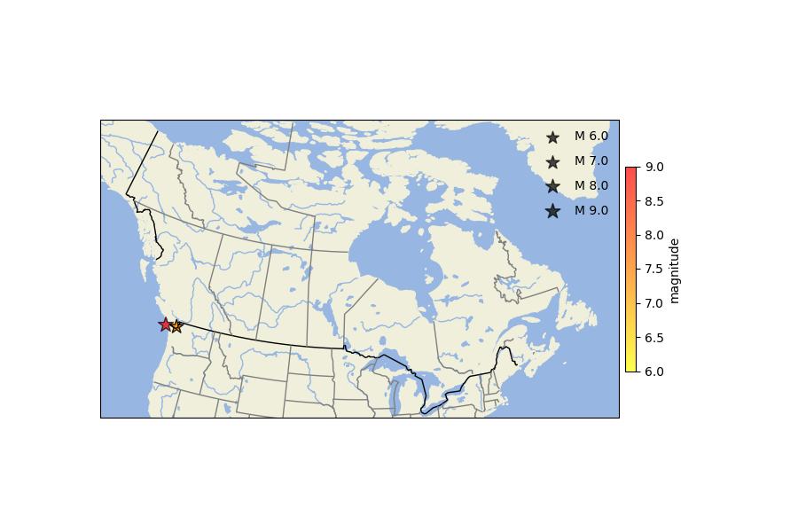

|   mag |    lat |      lon | name                              |
|------:|-------:|---------:|:----------------------------------|
|   9   | 48.25  | -125.217 | SIM9p0_CascadiaInterfaceBestFault |
|   7.3 | 48.405 | -123.412 | ACM7p3_LeechRiverFullFault        |