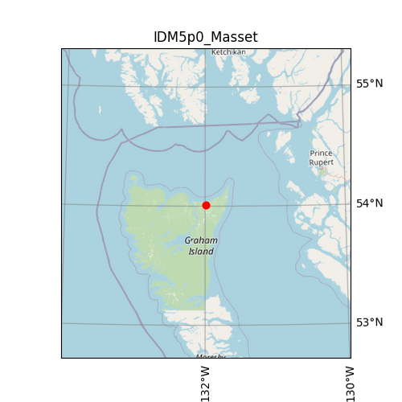

| Name                                | IDM5p0_Masset                                                                                                                                                                                                                                                                                                                                                                               |
|:------------------------------------|:--------------------------------------------------------------------------------------------------------------------------------------------------------------------------------------------------------------------------------------------------------------------------------------------------------------------------------------------------------------------------------------------|
| magnitude                           | 5.0                                                                                                                                                                                                                                                                                                                                                                                         |
| latitude                            | 54.010 degrees                                                                                                                                                                                                                                                                                                                                                                              |
| longitude                           | -131.987 degrees                                                                                                                                                                                                                                                                                                                                                                            |
| maximum_peak_ground_acceleration    | 0.023 g                                                                                                                                                                                                                                                                                                                                                                                     |
| cost                                | $1,498,318                                                                                                                                                                                                                                                                                                                                                                                  |
| redtag                              | 0 buildings                                                                                                                                                                                                                                                                                                                                                                                 |
| displaced                           | 0 people                                                                                                                                                                                                                                                                                                                                                                                    |
| deaths                              | 0 people                                                                                                                                                                                                                                                                                                                                                                                    |
| critical_injuries_and_entrapments   | 0 people                                                                                                                                                                                                                                                                                                                                                                                    |
| all_hospitalizations                | 0 people                                                                                                                                                                                                                                                                                                                                                                                    |
| epicentre_map                       |                                                                                                                                                                                                                                                                                                                                                              |
| shakemap_file                       | [s_shakemap_IDM5p0_Masset_84.csv](https://github.com/OpenDRR/earthquake-scenarios/blob/master/FINISHED/s_shakemap_IDM5p0_Masset_84.csv) [<kbd>Download</kbd>](https://github.com/OpenDRR/earthquake-scenarios/raw/master/FINISHED/s_shakemap_IDM5p0_Masset_84.csv)                                                                                                                      |
| damage_baseline_file                | [s_dmgbyasset_IDM5p0_Masset_b0_85_b.csv](https://github.com/OpenDRR/earthquake-scenarios/blob/master/FINISHED/s_dmgbyasset_IDM5p0_Masset_b0_85_b.csv) [<kbd>Download</kbd>](https://github.com/OpenDRR/earthquake-scenarios/raw/master/FINISHED/s_dmgbyasset_IDM5p0_Masset_b0_85_b.csv)                                                                                                 |
| damage_retrofitted_file             | [s_dmgbyasset_IDM5p0_Masset_r1_86_b.csv](https://github.com/OpenDRR/earthquake-scenarios/blob/master/FINISHED/s_dmgbyasset_IDM5p0_Masset_r1_86_b.csv) [<kbd>Download</kbd>](https://github.com/OpenDRR/earthquake-scenarios/raw/master/FINISHED/s_dmgbyasset_IDM5p0_Masset_r1_86_b.csv)                                                                                                 |
| consequence_baseline_file           | [s_consequences_IDM5p0_Masset_b0_85_b.csv](https://github.com/OpenDRR/earthquake-scenarios/blob/master/FINISHED/s_consequences_IDM5p0_Masset_b0_85_b.csv) [<kbd>Download</kbd>](https://github.com/OpenDRR/earthquake-scenarios/raw/master/FINISHED/s_consequences_IDM5p0_Masset_b0_85_b.csv)                                                                                           |
| consequence_retrofitted_file        | [s_consequences_IDM5p0_Masset_r1_86_b.csv](https://github.com/OpenDRR/earthquake-scenarios/blob/master/FINISHED/s_consequences_IDM5p0_Masset_r1_86_b.csv) [<kbd>Download</kbd>](https://github.com/OpenDRR/earthquake-scenarios/raw/master/FINISHED/s_consequences_IDM5p0_Masset_r1_86_b.csv)                                                                                           |
| loss_baseline_file                  | [s_lossesbyasset_IDM5p0_Masset_b0_87_b.csv](https://github.com/OpenDRR/earthquake-scenarios/blob/master/FINISHED/s_lossesbyasset_IDM5p0_Masset_b0_87_b.csv) [<kbd>Download</kbd>](https://github.com/OpenDRR/earthquake-scenarios/raw/master/FINISHED/s_lossesbyasset_IDM5p0_Masset_b0_87_b.csv)                                                                                        |
| loss_retrofitted_file               | [s_lossesbyasset_IDM5p0_Masset_r1_88_b.csv](https://github.com/OpenDRR/earthquake-scenarios/blob/master/FINISHED/s_lossesbyasset_IDM5p0_Masset_r1_88_b.csv) [<kbd>Download</kbd>](https://github.com/OpenDRR/earthquake-scenarios/raw/master/FINISHED/s_lossesbyasset_IDM5p0_Masset_r1_88_b.csv)                                                                                        |
| site_model_file                     | [openquake-inputs/earthquake/sites/regions/site-vgrid_BC.csv](https://github.com/OpenDRR/openquake-inputs/blob/main/earthquake/sites/regions/site-vgrid_BC.csv) [<kbd>Download</kbd>](https://github.com/OpenDRR/openquake-inputs/raw/main/earthquake/sites/regions/site-vgrid_BC.csv)                                                                                                  |
| rupture_model_file                  | [ruptures/rupture_IDM5p0_Masset.xml](https://github.com/OpenDRR/earthquake-scenarios/blob/master/FINISHED/ruptures/rupture_IDM5p0_Masset.xml) [<kbd>Download</kbd>](https://github.com/OpenDRR/earthquake-scenarios/raw/master/FINISHED/ruptures/rupture_IDM5p0_Masset.xml)                                                                                                             |
| rupture_mesh_spacing                | 4                                                                                                                                                                                                                                                                                                                                                                                           |
| gsim_logic_tree_file                | [CanadaSHM6/OpenQuake_model_files/gmms/LogicTree/OQ_classes_NGASa0p3weights_intraslab55.xml](https://github.com/OpenDRR/CanadaSHM6/blob/master/OpenQuake_model_files/gmms/LogicTree/OQ_classes_NGASa0p3weights_intraslab55.xml) [<kbd>Download</kbd>](https://github.com/OpenDRR/CanadaSHM6/raw/master/OpenQuake_model_files/gmms/LogicTree/OQ_classes_NGASa0p3weights_intraslab55.xml) |
| truncation_level_risk               | 3.0                                                                                                                                                                                                                                                                                                                                                                                         |
| maximum_distance                    | 1000                                                                                                                                                                                                                                                                                                                                                                                        |
| number_of_ground_motion_fields_risk | 400                                                                                                                                                                                                                                                                                                                                                                                         |
| exposure_file                       | [openquake-inputs/exposure/general-building-stock/oqBldgExp_BC.xml](https://github.com/OpenDRR/openquake-inputs/blob/main/exposure/general-building-stock/oqBldgExp_BC.xml) [<kbd>Download</kbd>](https://github.com/OpenDRR/openquake-inputs/raw/main/exposure/general-building-stock/oqBldgExp_BC.xml)                                                                                |
| taxonomy_mapping_baseline           | [openquake-inputs/earthquake/vulnerability/CanSRM1_TaxMap_b0.csv](https://github.com/OpenDRR/openquake-inputs/blob/main/earthquake/vulnerability/CanSRM1_TaxMap_b0.csv) [<kbd>Download</kbd>](https://github.com/OpenDRR/openquake-inputs/raw/main/earthquake/vulnerability/CanSRM1_TaxMap_b0.csv)                                                                                      |
| structural_fragility_file           | [openquake-inputs/earthquake/vulnerability/structural_fragility_CAN.xml](https://github.com/OpenDRR/openquake-inputs/blob/main/earthquake/vulnerability/structural_fragility_CAN.xml) [<kbd>Download</kbd>](https://github.com/OpenDRR/openquake-inputs/raw/main/earthquake/vulnerability/structural_fragility_CAN.xml)                                                                 |
| structural_vulnerability_file       | [openquake-inputs/earthquake/vulnerability/vulnerability_structural_CAN.xml](https://github.com/OpenDRR/openquake-inputs/blob/main/earthquake/vulnerability/vulnerability_structural_CAN.xml) [<kbd>Download</kbd>](https://github.com/OpenDRR/openquake-inputs/raw/main/earthquake/vulnerability/vulnerability_structural_CAN.xml)                                                     |
| nonstructural_vulnerability_file    | [openquake-inputs/earthquake/vulnerability/vulnerability_nonstructural_CAN.xml](https://github.com/OpenDRR/openquake-inputs/blob/main/earthquake/vulnerability/vulnerability_nonstructural_CAN.xml) [<kbd>Download</kbd>](https://github.com/OpenDRR/openquake-inputs/raw/main/earthquake/vulnerability/vulnerability_nonstructural_CAN.xml)                                            |
| contents_vulnerability_file         | [openquake-inputs/earthquake/vulnerability/vulnerability_contents_CAN.xml](https://github.com/OpenDRR/openquake-inputs/blob/main/earthquake/vulnerability/vulnerability_contents_CAN.xml) [<kbd>Download</kbd>](https://github.com/OpenDRR/openquake-inputs/raw/main/earthquake/vulnerability/vulnerability_contents_CAN.xml)                                                           |
| description                         | Magnitude 5.0 deep intraslab rupture based on 10 percent in 50 years deaggregation                                                                                                                                                                                                                                                                                                          |