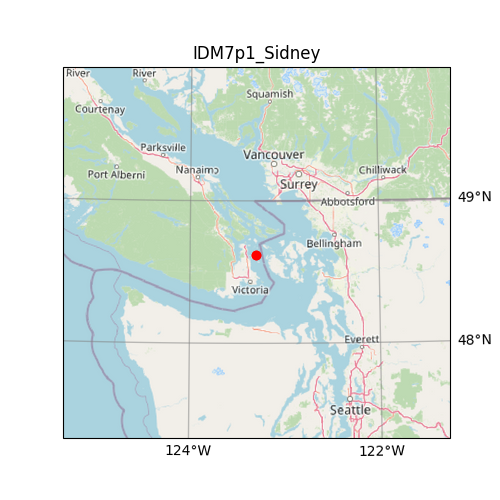

| Name                                | IDM7p1_Sidney                                                                                                                                                                                                                                                                                                         |
|:------------------------------------|:----------------------------------------------------------------------------------------------------------------------------------------------------------------------------------------------------------------------------------------------------------------------------------------------------------------------|
| magnitude                           | 7.1                                                                                                                                                                                                                                                                                                                   |
| latitude                            | 48.620 degrees                                                                                                                                                                                                                                                                                                        |
| longitude                           | -123.300 degrees                                                                                                                                                                                                                                                                                                      |
| maximum_peak_ground_acceleration    | 0.262 g                                                                                                                                                                                                                                                                                                               |
| recurrence rate                     | 1,188 years*                                                                                                                                                                                                                                                                                                          |
|                                     | *For Cascadia, Leech River, and Devil's Mountain Faults these are characteristic earthquakes, else they are recurrence interval for an event of equal or greater magnitude in the scenario source region.                                                                                                             |
| cost                                | $19,773,094,869                                                                                                                                                                                                                                                                                                       |
| redtag                              | 6,060 buildings                                                                                                                                                                                                                                                                                                       |
| displaced                           | 113,380 people                                                                                                                                                                                                                                                                                                        |
| deaths                              | 897 people                                                                                                                                                                                                                                                                                                            |
| critical_injuries_and_entrapments   | 437 people                                                                                                                                                                                                                                                                                                            |
| all_hospitalizations                | 3,412 people                                                                                                                                                                                                                                                                                                          |
| epicentre_map                       |                                                                                                                                                                                                                                                                                        |
| shakemap_file                       | ./s_shakemap_IDM7p1_Sidney_120.csv                                                                                                                                                                                                                                                                                    |
| damage_baseline_file                | ./s_dmgbyasset_IDM7p1_Sidney_b0_118_b.csv                                                                                                                                                                                                                                                                             |
| damage_retrofitted_file             | ./s_dmgbyasset_IDM7p1_Sidney_r1_119_b.csv                                                                                                                                                                                                                                                                             |
| consequence_baseline_file           | ./s_consequences_IDM7p1_Sidney_b0_118_b.csv                                                                                                                                                                                                                                                                           |
| consequence_retrofitted_file        | ./s_consequences_IDM7p1_Sidney_r1_119_b.csv                                                                                                                                                                                                                                                                           |
| loss_baseline_file                  | ./s_lossesbyasset_IDM7p1_Sidney_b0_121_b.csv                                                                                                                                                                                                                                                                          |
| loss_retrofitted_file               | ./s_lossesbyasset_IDM7p1_Sidney_r1_122_b.csv                                                                                                                                                                                                                                                                          |
| site_model_file                     | ../../openquake-inputs/earthquake/sites/regions/site-vgrid_BC.csv                                                                                                                                                                                                                                                     |
| rupture_model_file                  | ../ruptures/rupture_IDM7p1_Sidney.xml                                                                                                                                                                                                                                                                                 |
| rupture_mesh_spacing                | 4                                                                                                                                                                                                                                                                                                                     |
| gsim_logic_tree_file                | ../../CanadaSHM6/OpenQuake_model_files/gmms/LogicTree/OQ_classes_NGASa0p3weights_intraslab55.xml                                                                                                                                                                                                                      |
| truncation_level_risk               | 3.0                                                                                                                                                                                                                                                                                                                   |
| maximum_distance                    | 400                                                                                                                                                                                                                                                                                                                   |
| number_of_ground_motion_fields_risk | 400                                                                                                                                                                                                                                                                                                                   |
| exposure_file                       | ../../openquake-inputs/exposure/general-building-stock/oqBldgExp_BC.xml                                                                                                                                                                                                                                               |
| taxonomy_mapping_baseline           | ../../openquake-inputs/earthquake/vulnerability/CanSRM1_TaxMap_b0.csv                                                                                                                                                                                                                                                 |
| structural_fragility_file           | ../../openquake-inputs/earthquake/vulnerability/structural_fragility_CAN.xml                                                                                                                                                                                                                                          |
| structural_vulnerability_file       | ../../openquake-inputs/earthquake/vulnerability/vulnerability_structural_CAN.xml                                                                                                                                                                                                                                      |
| nonstructural_vulnerability_file    | ../../openquake-inputs/earthquake/vulnerability/vulnerability_nonstructural_CAN.xml                                                                                                                                                                                                                                   |
| contents_vulnerability_file         | ../../openquake-inputs/earthquake/vulnerability/vulnerability_contents_CAN.xml                                                                                                                                                                                                                                        |
| description                         | Evaluating impact of increasing magnitude using the 2015 Mw 4.7 Sidney, BC, Earthquake hypocentre. More info at https://earthquakescanada.nrcan.gc.ca/recent/2015/20151230.0739/index-en.php - Strike selected to approximately parallel the strike of the subducting slab for this deep intraslab extensional event. |