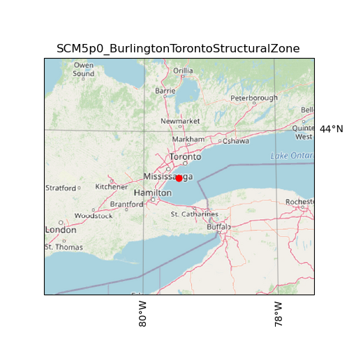

| Name                                | SCM5p0_BurlingtonTorontoStructuralZone                                                                                                                                                                                                                                                                                                                                                      |
|:------------------------------------|:--------------------------------------------------------------------------------------------------------------------------------------------------------------------------------------------------------------------------------------------------------------------------------------------------------------------------------------------------------------------------------------------|
| magnitude                           | 5.0                                                                                                                                                                                                                                                                                                                                                                                         |
| latitude                            | 43.490 degrees                                                                                                                                                                                                                                                                                                                                                                              |
| longitude                           | -79.470 degrees                                                                                                                                                                                                                                                                                                                                                                             |
| maximum_peak_ground_acceleration    | 0.201 g                                                                                                                                                                                                                                                                                                                                                                                     |
| recurrence rate                     | 99 years*                                                                                                                                                                                                                                                                                                                                                                                   |
|                                     | *For Cascadia, Leech River, and Devil's Mountain Faults these are characteristic earthquakes, else they are recurrence interval for an event of equal or greater magnitude in the scenario source region.                                                                                                                                                                                   |
| cost                                | $2,430,406,228                                                                                                                                                                                                                                                                                                                                                                              |
| redtag                              | 17 buildings                                                                                                                                                                                                                                                                                                                                                                                |
| displaced                           | 94 people                                                                                                                                                                                                                                                                                                                                                                                   |
| deaths                              | 2 people                                                                                                                                                                                                                                                                                                                                                                                    |
| critical_injuries_and_entrapments   | 1 people                                                                                                                                                                                                                                                                                                                                                                                    |
| all_hospitalizations                | 16 people                                                                                                                                                                                                                                                                                                                                                                                   |
| epicentre_map                       |                                                                                                                                                                                                                                                                                                                                     |
| shakemap_file                       | [s_shakemap_SCM5p0_BurlingtonTorontoStructuralZone_96.csv](https://github.com/OpenDRR/earthquake-scenarios/blob/master/FINISHED/s_shakemap_SCM5p0_BurlingtonTorontoStructuralZone_96.csv) [<kbd>Download</kbd>](https://github.com/OpenDRR/earthquake-scenarios/raw/master/FINISHED/s_shakemap_SCM5p0_BurlingtonTorontoStructuralZone_96.csv)                                           |
| damage_baseline_file                | [s_dmgbyasset_SCM5p0_BurlingtonTorontoStructuralZone_b0_97_b.csv](https://github.com/OpenDRR/earthquake-scenarios/blob/master/FINISHED/s_dmgbyasset_SCM5p0_BurlingtonTorontoStructuralZone_b0_97_b.csv) [<kbd>Download</kbd>](https://github.com/OpenDRR/earthquake-scenarios/raw/master/FINISHED/s_dmgbyasset_SCM5p0_BurlingtonTorontoStructuralZone_b0_97_b.csv)                      |
| damage_retrofitted_file             | [s_dmgbyasset_SCM5p0_BurlingtonTorontoStructuralZone_r1_98_b.csv](https://github.com/OpenDRR/earthquake-scenarios/blob/master/FINISHED/s_dmgbyasset_SCM5p0_BurlingtonTorontoStructuralZone_r1_98_b.csv) [<kbd>Download</kbd>](https://github.com/OpenDRR/earthquake-scenarios/raw/master/FINISHED/s_dmgbyasset_SCM5p0_BurlingtonTorontoStructuralZone_r1_98_b.csv)                      |
| consequence_baseline_file           | [s_consequences_SCM5p0_BurlingtonTorontoStructuralZone_b0_97_b.csv](https://github.com/OpenDRR/earthquake-scenarios/blob/master/FINISHED/s_consequences_SCM5p0_BurlingtonTorontoStructuralZone_b0_97_b.csv) [<kbd>Download</kbd>](https://github.com/OpenDRR/earthquake-scenarios/raw/master/FINISHED/s_consequences_SCM5p0_BurlingtonTorontoStructuralZone_b0_97_b.csv)                |
| consequence_retrofitted_file        | [s_consequences_SCM5p0_BurlingtonTorontoStructuralZone_r1_98_b.csv](https://github.com/OpenDRR/earthquake-scenarios/blob/master/FINISHED/s_consequences_SCM5p0_BurlingtonTorontoStructuralZone_r1_98_b.csv) [<kbd>Download</kbd>](https://github.com/OpenDRR/earthquake-scenarios/raw/master/FINISHED/s_consequences_SCM5p0_BurlingtonTorontoStructuralZone_r1_98_b.csv)                |
| loss_baseline_file                  | [s_lossesbyasset_SCM5p0_BurlingtonTorontoStructuralZone_b0_99_b.csv](https://github.com/OpenDRR/earthquake-scenarios/blob/master/FINISHED/s_lossesbyasset_SCM5p0_BurlingtonTorontoStructuralZone_b0_99_b.csv) [<kbd>Download</kbd>](https://github.com/OpenDRR/earthquake-scenarios/raw/master/FINISHED/s_lossesbyasset_SCM5p0_BurlingtonTorontoStructuralZone_b0_99_b.csv)             |
| loss_retrofitted_file               | [s_lossesbyasset_SCM5p0_BurlingtonTorontoStructuralZone_r1_100_b.csv](https://github.com/OpenDRR/earthquake-scenarios/blob/master/FINISHED/s_lossesbyasset_SCM5p0_BurlingtonTorontoStructuralZone_r1_100_b.csv) [<kbd>Download</kbd>](https://github.com/OpenDRR/earthquake-scenarios/raw/master/FINISHED/s_lossesbyasset_SCM5p0_BurlingtonTorontoStructuralZone_r1_100_b.csv)          |
| site_model_file                     | [openquake-inputs/earthquake/sites/regions/site-vgrid_CA.csv](https://github.com/OpenDRR/openquake-inputs/blob/main/earthquake/sites/regions/site-vgrid_CA.csv) [<kbd>Download</kbd>](https://github.com/OpenDRR/openquake-inputs/raw/main/earthquake/sites/regions/site-vgrid_CA.csv)                                                                                                  |
| rupture_model_file                  | [ruptures/rupture_SCM5p0_BurlingtonTorontoStructuralZone.xml](https://github.com/OpenDRR/earthquake-scenarios/blob/master/ruptures/rupture_SCM5p0_BurlingtonTorontoStructuralZone.xml) [<kbd>Download</kbd>](https://github.com/OpenDRR/earthquake-scenarios/raw/master/ruptures/rupture_SCM5p0_BurlingtonTorontoStructuralZone.xml)                                                    |
| rupture_mesh_spacing                | 4                                                                                                                                                                                                                                                                                                                                                                                           |
| gsim_logic_tree_file                | [CanadaSHM6/OpenQuake_model_files/gmms/LogicTree/OQ_classes_NGASa0p3weights_stablecrust.xml](https://github.com/OpenDRR/CanadaSHM6/blob/master/OpenQuake_model_files/gmms/LogicTree/OQ_classes_NGASa0p3weights_stablecrust.xml) [<kbd>Download</kbd>](https://github.com/OpenDRR/CanadaSHM6/raw/master/OpenQuake_model_files/gmms/LogicTree/OQ_classes_NGASa0p3weights_stablecrust.xml) |
| truncation_level_risk               | 3.0                                                                                                                                                                                                                                                                                                                                                                                         |
| maximum_distance                    | 600                                                                                                                                                                                                                                                                                                                                                                                         |
| number_of_ground_motion_fields_risk | 200                                                                                                                                                                                                                                                                                                                                                                                         |
| exposure_file                       | [openquake-inputs/exposure/general-building-stock/oqBldgExp_CE.xml](https://github.com/OpenDRR/openquake-inputs/blob/main/exposure/general-building-stock/oqBldgExp_CE.xml) [<kbd>Download</kbd>](https://github.com/OpenDRR/openquake-inputs/raw/main/exposure/general-building-stock/oqBldgExp_CE.xml)                                                                                |
| taxonomy_mapping_baseline           | [openquake-inputs/earthquake/vulnerability/CanSRM1_TaxMap_b0.csv](https://github.com/OpenDRR/openquake-inputs/blob/main/earthquake/vulnerability/CanSRM1_TaxMap_b0.csv) [<kbd>Download</kbd>](https://github.com/OpenDRR/openquake-inputs/raw/main/earthquake/vulnerability/CanSRM1_TaxMap_b0.csv)                                                                                      |
| structural_fragility_file           | [openquake-inputs/earthquake/vulnerability/structural_fragility_CAN.xml](https://github.com/OpenDRR/openquake-inputs/blob/main/earthquake/vulnerability/structural_fragility_CAN.xml) [<kbd>Download</kbd>](https://github.com/OpenDRR/openquake-inputs/raw/main/earthquake/vulnerability/structural_fragility_CAN.xml)                                                                 |
| structural_vulnerability_file       | [openquake-inputs/earthquake/vulnerability/vulnerability_structural_CAN.xml](https://github.com/OpenDRR/openquake-inputs/blob/main/earthquake/vulnerability/vulnerability_structural_CAN.xml) [<kbd>Download</kbd>](https://github.com/OpenDRR/openquake-inputs/raw/main/earthquake/vulnerability/vulnerability_structural_CAN.xml)                                                     |
| nonstructural_vulnerability_file    | [openquake-inputs/earthquake/vulnerability/vulnerability_nonstructural_CAN.xml](https://github.com/OpenDRR/openquake-inputs/blob/main/earthquake/vulnerability/vulnerability_nonstructural_CAN.xml) [<kbd>Download</kbd>](https://github.com/OpenDRR/openquake-inputs/raw/main/earthquake/vulnerability/vulnerability_nonstructural_CAN.xml)                                            |
| contents_vulnerability_file         | [openquake-inputs/earthquake/vulnerability/vulnerability_contents_CAN.xml](https://github.com/OpenDRR/openquake-inputs/blob/main/earthquake/vulnerability/vulnerability_contents_CAN.xml) [<kbd>Download</kbd>](https://github.com/OpenDRR/openquake-inputs/raw/main/earthquake/vulnerability/vulnerability_contents_CAN.xml)                                                           |
| description                         | Magnitude 5.0 rupture possibly along the Burlington Toronto Structural Zone based on 10 percent in 50 years seismic hazard deaggregation and lineament map of western Lake Ontario area by Wallach et al 1998. Possible kinematics based on tectonic stress regime indicated in World Stress Map by Heidbach et al 2016.                                                                    |
