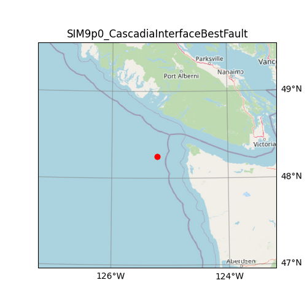

| Name                                | SIM9p0_CascadiaInterfaceBestFault                                                                                                                                                                         |
|:------------------------------------|:----------------------------------------------------------------------------------------------------------------------------------------------------------------------------------------------------------|
| magnitude                           | 9.0                                                                                                                                                                                                       |
| latitude                            | 48.250 degrees                                                                                                                                                                                            |
| longitude                           | -125.217 degrees                                                                                                                                                                                          |
| maximum_peak_ground_acceleration    | 0.372 g                                                                                                                                                                                                   |
| recurrence rate                     | 433 years*                                                                                                                                                                                                |
|                                     | *For Cascadia, Leech River, and Devil's Mountain Faults these are characteristic earthquakes, else they are recurrence interval for an event of equal or greater magnitude in the scenario source region. |
| cost                                | $38,402,326,693                                                                                                                                                                                           |
| redtag                              | 18,375 buildings                                                                                                                                                                                          |
| displaced                           | 577,039 people                                                                                                                                                                                            |
| deaths                              | 3,417 people                                                                                                                                                                                              |
| critical_injuries_and_entrapments   | 1,709 people                                                                                                                                                                                              |
| all_hospitalizations                | 12,610 people                                                                                                                                                                                             |
| epicentre_map                       |                                                                                                                                                        |
| shakemap_file                       | ./s_shakemap_SIM9p0_CascadiaInterfaceBestFault_11.csv                                                                                                                                                     |
| damage_baseline_file                | ./s_dmgbyasset_SIM9p0_CascadiaInterfaceBestFault_b0_317_b.csv                                                                                                                                             |
| damage_retrofitted_file             | ./s_dmgbyasset_SIM9p0_CascadiaInterfaceBestFault_r1_318_b.csv                                                                                                                                             |
| consequence_baseline_file           | ./s_consequences_SIM9p0_CascadiaInterfaceBestFault_b0_317_b.csv                                                                                                                                           |
| consequence_retrofitted_file        | ./s_consequences_SIM9p0_CascadiaInterfaceBestFault_r1_318_b.csv                                                                                                                                           |
| loss_baseline_file                  | ./s_lossesbyasset_SIM9p0_CascadiaInterfaceBestFault_b0_319_b.csv                                                                                                                                          |
| loss_retrofitted_file               | ./s_lossesbyasset_SIM9p0_CascadiaInterfaceBestFault_r1_320_b.csv                                                                                                                                          |
| site_model_file                     | ../../../openquake-inputs/earthquake/sites/regions/site-vgrid_BC.csv                                                                                                                                      |
| rupture_model_file                  | ../ruptures/rupture_SIM9p0_CascadiaInterfaceBestFault.xml                                                                                                                                                 |
| rupture_mesh_spacing                | 4                                                                                                                                                                                                         |
| gsim_logic_tree_file                | ../../../CanadaSHM6/OpenQuake_model_files/gmms/LogicTree/ OQ_classes_NGASa0p3weights_interface.xml                                                                                                         |
| truncation_level_risk               | 3.0                                                                                                                                                                                                       |
| maximum_distance                    | 1000                                                                                                                                                                                                      |
| number_of_ground_motion_fields_risk | 200                                                                                                                                                                                                       |
| exposure_file                       | ../../../openquake-inputs/exposure/general-building-stock/oqBldgExp_BC.xml                                                                                                                                |
| taxonomy_mapping_baseline           | ../../../openquake-inputs/earthquake/vulnerability/CanSRM1_TaxMap_b0.csv                                                                                                                                  |
| structural_fragility_file           | ../../../openquake-inputs/earthquake/vulnerability/structural_fragility_CAN.xml                                                                                                                           |
| structural_vulnerability_file       | ../../../openquake-inputs/earthquake/vulnerability/vulnerability_structural_CAN.xml                                                                                                                       |
| nonstructural_vulnerability_file    | ../../../openquake-inputs/earthquake/vulnerability/vulnerability_nonstructural_CAN.xml                                                                                                                    |
| contents_vulnerability_file         | ../../../openquake-inputs/earthquake/vulnerability/vulnerability_contents_CAN.xml                                                                                                                         |
| description                         | 	Magnitude 9.0 scenario based on complete rupture of the CanSHM6 Hazard Model implementation of the Cascadia Interface Best Fault.                                                                                                                                                                                                         |
